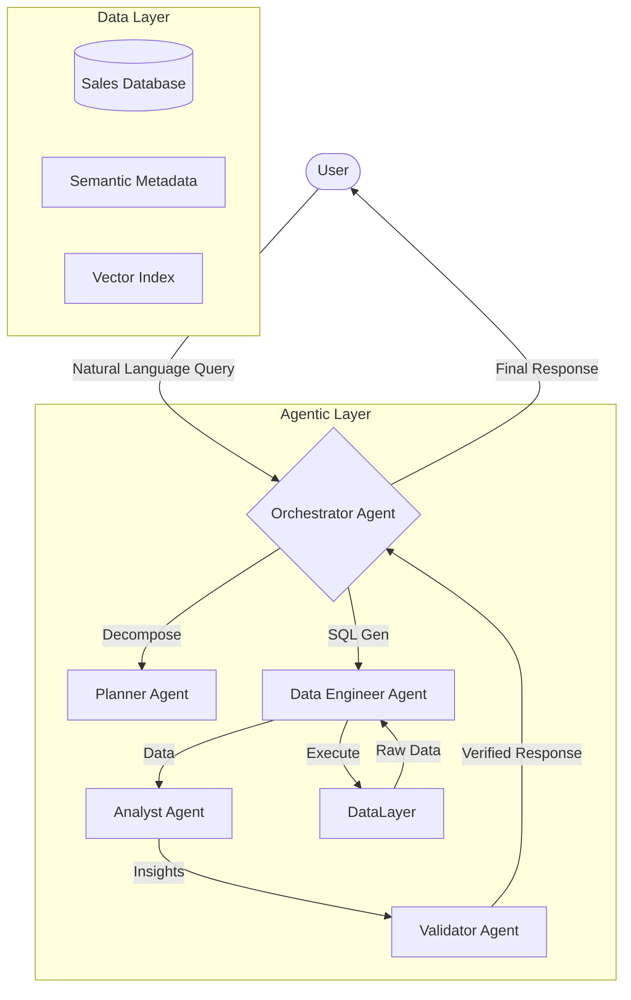

# Retail Insights Assistant
## GenAI + Scalable Data System

---

### 1. System Architecture & Data Flow

#### High-Level Overview
The system follows a modular **Multi-Agent Architecture** designed for extensibility and scalability.



**Workflow:**
1.  **Input**: User sends a natural language query.
2.  **Plan**: `PlannerAgent` decomposes complex queries into steps.
3.  **Extraction**: `DataEngineerAgent` converts natural language to optimized SQL.
4.  **Execution**: Data is retrieved from the Data Layer (DuckDB/SQL).
5.  **Analysis**: `AnalystAgent` generates business insights from the data.
6.  **Safety**: `ValidatorAgent` ensures SQL safety and response accuracy (hallucination check).

---

### 2. Scalability Strategy (100GB+)

Handling 100GB+ of sales data requires moving beyond in-memory processing (Pandas) to distributed or disk-optimized systems.

#### A. Data Engineering & Storage
*   **Current (MVP)**: SQLite/DuckDB (Local File).
*   **Proposed (100GB+)**:
    *   **Warehouse**: **Snowflake** or **Google BigQuery** for separation of storage and compute.
    *   **Format**: **Parquet/Delta Lake** in S3/GCS buckets for cost-effective storage of raw logs.
    *   **Processing**: **PySpark** or **dbt** for batch transformations (ETL).

#### B. Retrieval Efficiency
*   **Partitioning**: Time-based (e.g., Year/Month) and Region-based partitioning to minimize scan overhead.
*   **Aggregated Tables**: Pre-compute common metrics (Revenue by Region, Monthly Sales) to serve 80% of queries instantly.
*   **Vector Search**: Index product descriptions and reviews in **Qdrant** or **Pinecone** for semantic search ("Find products like X").

---

### 3. LLM Integration Strategy

We leverage a **Hub-and-Spoke** model for LLM interaction to optimize cost and performance.

*   **Models**:
    *   **Complex Logic (Planning/Orchestrator)**: `GPT-4o` or `Gemini 1.5 Pro` (High reasoning).
    *   **Specific Tasks (SQL Gen/Summarization)**: `GPT-3.5-Turbo` or `Llama 3 70B` (Fast, cheaper).
*   **Context Management**:
    *   **RAG (Retrieval-Augmented Generation)**: Retrieve only relevant schema components and valid column values (e.g., specific Product IDs) before prompting the LLM.
    *   **Memory**: Conversation history stored in Redis for maintaining context across turns.

---

### 4. Example Query Pipeline

**Query:** "Which region had the highest growth in Q3 2024?"

1.  **Orchestrator**: Identifies intent: `Trend Analysis`.
2.  **Data Engineer**:
    *   Looks up schema.
    *   Generates SQL:
        ```sql
        SELECT Region, SUM(Amount) as Sales
        FROM Sales
        WHERE Date BETWEEN '2024-07-01' AND '2024-09-30'
        GROUP BY Region
        ORDER BY Sales DESC;
        ```
3.  **Data Layer**: Returns: `{'Region': 'West', 'Sales': 125000}, ...`
4.  **Analyst**: Compares with previous data (if requested) and generates narrative: "The West region led with $125k in sales..."
5.  **Validator**: Checks if SQL matches intent and if numbers in text match data.

---

### 5. Cost & Performance Considerations

*   **Caching**: Cache SQL results for identical queries (TTL: 24h).
*   **Output Consistency**: Use **Pydantic** or **Instructor** to enforce structured JSON outputs from LLMs.
*   **Latency**: Streaming responses to UI to reduce perceived wait time.
